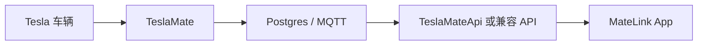
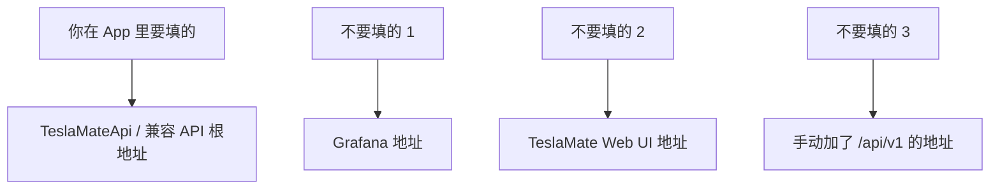

# MateLink 普通用户部署与配置指南

> 适用对象：只想在 MateLink 里看到自己 Tesla 车辆数据的普通用户
>
> 这份指南不讲源码，不要求你会开发。你只需要知道怎么准备服务器、怎么填写 App 配置，以及哪里最容易填错。

## 1. 一句话先讲清楚

MateLink 不是直接登录 Tesla 官方账号的 App。

MateLink 读取的是你自己部署的 TeslaMate 数据服务。

想看到自己车辆数据，你至少需要这套链路：



你在 MateLink 里真正要填写的，不是 Tesla 账号，不是 Grafana 地址，而是：

`TeslaMateApi / 兼容 API 的根地址`

例如：

- `https://teslamate-api.example.com`
- `http://192.168.1.100:4000`

不要填写：

- `https://teslamate.example.com/api/v1`
- `https://grafana.example.com`
- `https://teslamate.example.com`

## 2. 你需要准备什么

想看真实车辆数据，用户需要准备 4 样东西：

1. 一台长期在线的主机
   例如：NAS、VPS、家里的小主机、迷你电脑、长期在线台式机。
2. 一套已经运行的 `TeslaMate`
   它负责采集车辆数据并写入数据库。
3. 一个能对外提供 HTTP 数据的 `TeslaMateApi / MateLink-compatible API`
   MateLink 通过它读取车辆、状态、充电和行程数据。
4. 一个让手机能访问到这个 API 的网络入口
   例如：局域网地址、VPN、Tailscale、Cloudflare Tunnel 或 HTTPS 反向代理。

如果你只是想看演示界面，不想自建服务器，可以用 Mock Mode。
但 Mock Mode 不是你的真实车辆数据。

## 3. 服务器应该怎么搭

对普通用户，推荐按下面的难度理解：

| 方案 | 适合谁 | 说明 |
| --- | --- | --- |
| NAS + Docker | 家里有 NAS 的用户 | 长期开机，最适合家庭自托管 |
| VPS + Docker | 想随时外网访问的用户 | 稳定，但需要公网安全配置 |
| 家用主机 + Docker | 已有常开电脑的用户 | 入门简单，但要保证长期在线 |

推荐组合：

```text
TeslaMate + Postgres + MQTT + TeslaMateApi(或兼容 API)
```

推荐阅读：

- TeslaMate 官方仓库：[teslamate-org/teslamate](https://github.com/teslamate-org/teslamate)
- TeslaMate Docker 安装文档：[Docker install](https://docs.teslamate.org/docs/installation/docker/)
- TeslaMate 官方项目列表（可查找相关 API 项目）：[Projects using TeslaMate](https://docs.teslamate.org/docs/projects/)

### 最简单的理解

- `TeslaMate` 负责“采集和存储”
- `TeslaMateApi` 负责“把数据变成 App 可读接口”
- `MateLink` 负责“显示给你看”

## 4. 正确的配置关系

很多用户第一步就填错地址，原因是把不同服务混在一起了。



### App 里应填写什么

| 字段 | 要不要填 | 正确示例 | 说明 |
| --- | --- | --- | --- |
| API 根地址 | 必填 | `https://teslamate-api.example.com` | 最重要的字段，不要加 `/api/v1` |
| API Token | 选填 | `abc123...` | 只有你的 API 开了鉴权才需要 |
| HTTP Basic Auth | 选填 | 用户名/密码 | 只有你前面套了反向代理认证才需要 |
| Secondary API | 选填 | `http://192.168.1.100:4000` | 安卓可做主公网 + 家内网备用 |
| 接受无效证书 | 高级选项 | 一般不建议 | 仅自签名 HTTPS 场景使用 |
| Mock Mode | 选填 | 开 / 关 | 只用于演示或离线浏览 |

## 5. 用户实际操作步骤

下面这套流程，就是普通用户从零到看到自己车辆数据的最短路径。

### 第一步：先把服务搭起来

先确认下面三件事：

- TeslaMate 已经在服务器上运行
- TeslaMateApi 或兼容 API 已经运行
- 手机能访问这个 API 地址

Tesla 账号授权是在 TeslaMate 页面里完成的，不是在 MateLink 里完成。MateLink 不保存 Tesla 账号密码，也不直接向 Tesla 官方登录；MateLink 只读取你的 TeslaMateApi 数据。

如果你在家里局域网测试，可以先用类似：

`http://192.168.1.100:4000`

如果你要在外网访问，推荐：

- Tailscale
- VPN
- Cloudflare Tunnel
- HTTPS 反向代理

不建议把裸 `HTTP` 直接暴露到公网。

### 第二步：打开 MateLink

进入首次引导页或设置页，找到连接配置区域。

你要填的是：

- API 根地址
- 可选 API Token

正确例子：

```text
API 根地址: https://teslamate-api.example.com
API Token: （如果你的 API 需要就填，不需要可以留空）
```

错误例子：

```text
https://teslamate-api.example.com/api/v1
https://grafana.example.com
https://teslamate.example.com
```

### 第三步：点击“测试连接”

MateLink 当前的连接检查逻辑，可以理解为三步：

1. 先确认服务器能不能通
2. 再确认服务是不是可用
3. 最后确认能不能真的拿到车辆列表

如果这一关成功，才说明你配的是“真正可读车辆数据的 API”，而不是只打开了某个网页。

### 第四步：保存并进入 Dashboard

测试通过后保存配置，MateLink 就会开始读取：

- 车辆列表
- 当前车辆状态
- 行程
- 充电
- 电池和分析相关数据

这时 Dashboard 才会显示你的真实车辆数据。

## 6. 最容易填错的地方

这是最关键的一节。很多“连不上”其实都不是程序坏了，而是输入对象错了。

| 常见错误 | 现象 | 正确做法 |
| --- | --- | --- |
| 把 Grafana 地址填进 App | 返回 HTML、页面、登录页，或解析失败 | 填 TeslaMateApi / 兼容 API 根地址 |
| 把 TeslaMate Web UI 地址填进 App | 看起来能打开，但拿不到车辆 JSON | 填 API 服务地址，不是网页地址 |
| 手动追加 `/api/v1` | 某些接口变成重复路径 | 只填根地址，让 App 自己拼接口路径 |
| 忘记开外网访问或 VPN | 手机上超时、连接失败 | 先确认手机网络能访问服务器 |
| Token 错误 | 401 或未授权 | 重新生成或检查 Token |
| 自签名证书问题 | HTTPS 报证书错误 | 用正式证书，或仅在受信环境下开启“接受无效证书” |
| 服务器其实没启动 API | ping 通但拿不到车辆 | 确认 TeslaMateApi / 兼容 API 已运行 |

## 7. 看到这些错误时该怎么判断

| 提示或现象 | 通常代表什么 |
| --- | --- |
| `401` / 未授权 | Token 错了，或者服务要求鉴权 |
| 超时 | 手机到服务器的网络不通 |
| 返回网页 HTML | 你填成了 Web UI / Grafana 地址 |
| 连接成功但没有车辆 | TeslaMate 端还没采到车辆，或 API 没暴露正确数据 |
| 只有演示图表 | 你还在 Mock Mode，或者真实连接没保存成功 |

## 8. 高德 Key 什么时候需要

高德 API Key 不是“看到车辆基础数据”的前置条件。

它主要影响中国区地图、地理编码、位置体验。

所以普通用户可以这样理解：

- 想先看到车辆、电量、充电、行程：可以先不配高德 Key
- 想把地图和地理位置体验补完整：再去申请高德 Key

高德申请地址：

[创建应用和 Key](https://lbs.amap.com/api/webservice/create-project-and-key)

注意：

- Key 由用户自己申请
- 不要把真实 Key 写进仓库
- Android / iOS / Web 的 Key 约束方式可能不同

## 9. 需要服务器吗

答案很直接：

- 看真实数据：需要服务器
- 只看演示界面：不需要服务器

所以这不是“装个 App 直接登录 Tesla 就行”的产品路线。
MateLink 当前路线是：

`用户自托管 TeslaMate 数据源 -> App 连接自己的 API`

## 10. 推荐给普通用户的最稳妥方案

如果你想尽量少踩坑，推荐这样做：

1. 在 NAS 或 VPS 上用 Docker 部署 TeslaMate
2. 再部署 TeslaMateApi 或兼容 API
3. 先在浏览器里确认 API 地址是通的
4. 再把这个根地址填进 MateLink
5. 在外网访问时优先用 Tailscale 或 HTTPS 反代
6. 先不折腾高德 Key，等基础数据跑通后再补

## 11. 配置完成后的结果

配置成功后，用户应该能在 MateLink 里逐步看到：

- 车辆列表
- 当前车辆状态
- 电量、续航、锁车、空调、胎压
- 行程历史
- 充电历史
- 部分分析页真实数据

如果你看到的是 Mock 标记、演示图、占位图，说明你还没真正切到真实数据链路。

## 12. 给用户的快速检查清单

配置前先对照这 6 条：

- 我有一台长期在线服务器 / NAS / VPS
- TeslaMate 已经跑起来
- TeslaMateApi 或兼容 API 已经跑起来
- 我手里拿到的是 API 根地址，不是网页地址
- 我没有手动加 `/api/v1`
- 如果有鉴权，我准备好了正确的 Token

如果这 6 条都满足，MateLink 基本就能连上你的真实车辆数据。
